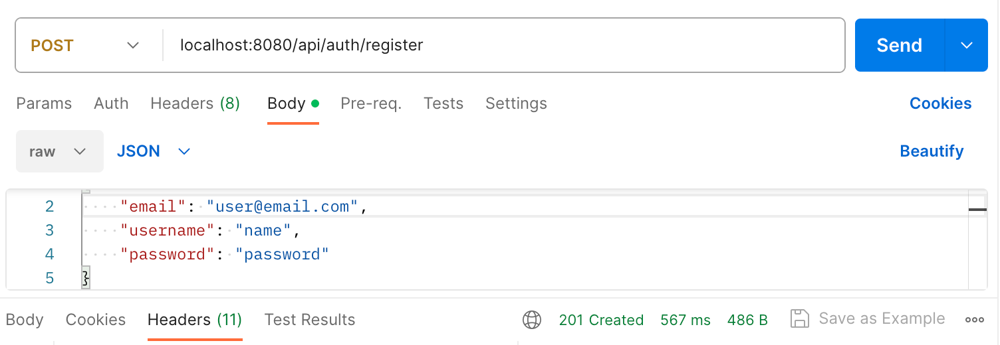
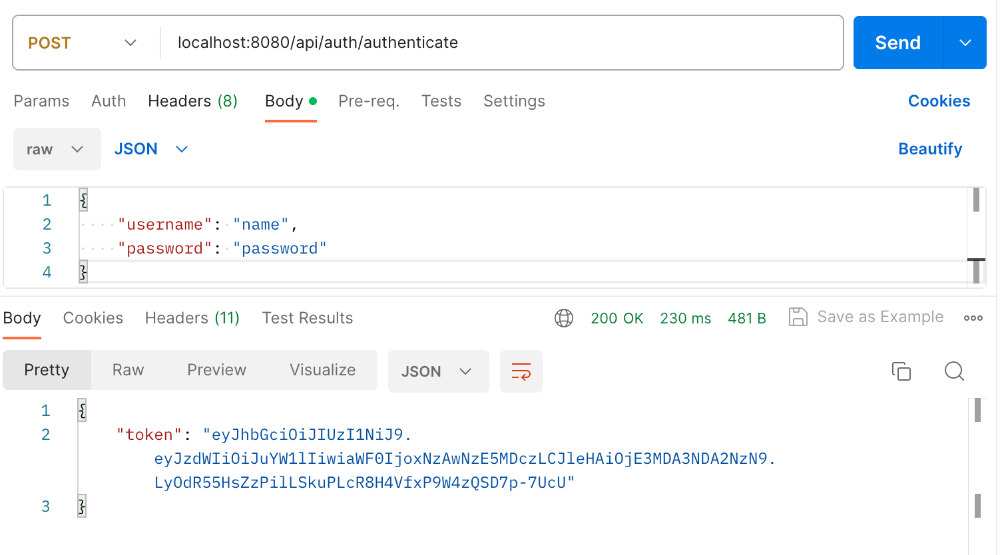
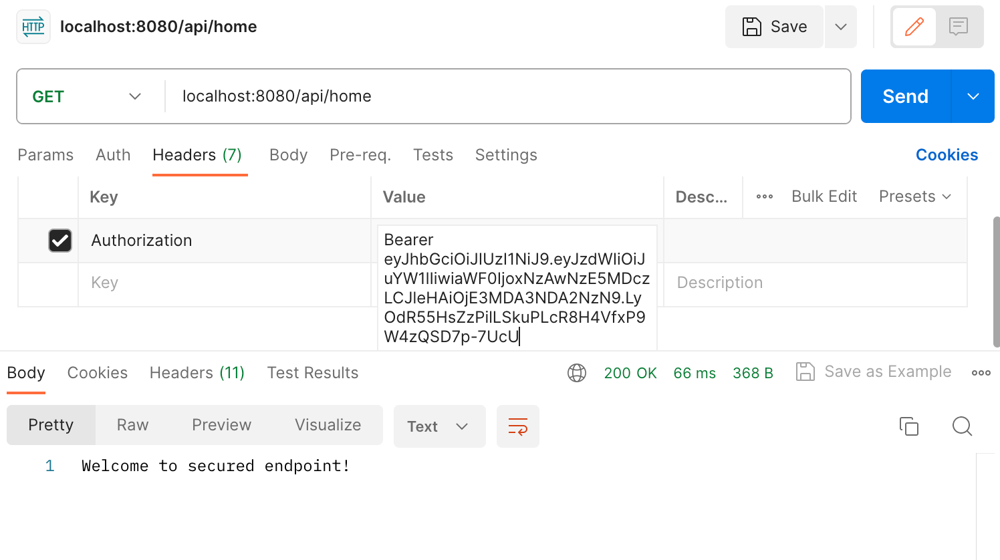

# spring-security

## 1. Spec
```
- Spring-Boot 3.1.3
- Spring-Security 6.0.11
- Java 17
- H2 DataBase(개발용으로 사용하기 위해서 저장이 필요 없을 것이라 판단하여 적용)
- IntelliJ IDEA
- gradle 8.4
```

## 2. why spring security 6.x version?
```
- spring-boot 3.x 버전은 spring 2.x에서 사용됐던 security 코드들이 deprecated 돼서 더이상 사용이 안되는 문제.
- spring-security reference가 적어서 기록.
- 공식문서를 보면서 customizing을 시도해보기 위함
- spring security의 flow에 대해서 다시 한번 학습
- 다른 project에 적용하기 위해 사전 testing
```

## 3. API Examples(JWT Token 기반)

### - Sign Up(POST)
```HTTP
localhost:8080/api/auth/register
{
    "email": "user@email.com",
    "username": "name",
    "password": "password"
}
```
#### : Postman request and result image



### - Sign In(POST)
```HTTP
localhost:8080/api/auth/login
{
    "username": "name",
    "password": "password"
}
```
#### : Postman request and result image



### - Get User(GET)
```HTTP
//요청 전 헤더에 셋팅: Authorization: Bearer {token} 
localhost:8080/api/user
```
#### : Postman request and result image



---

## Reference

- https://docs.spring.io/spring-security/reference/servlet/authentication/architecture.html
- https://github.com/CristianSur/kotlin-jwt-spring-security-6/
- https://www.baeldung.com/spring-redirect-after-login
- https://spring.io/guides/tutorials/spring-boot-oauth2/
